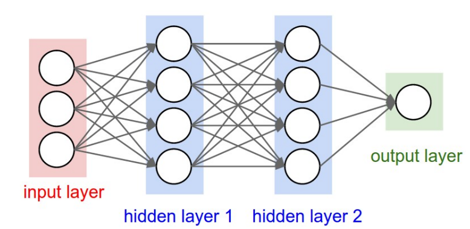
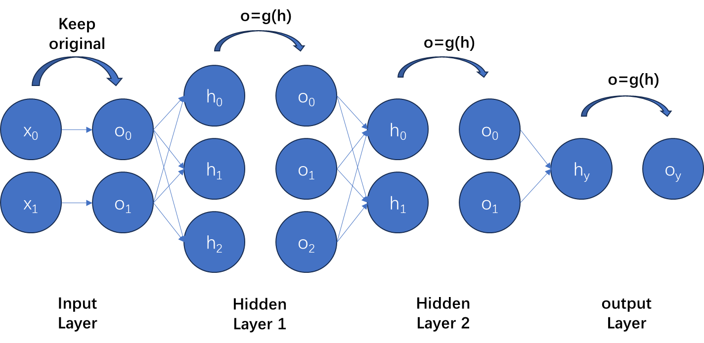
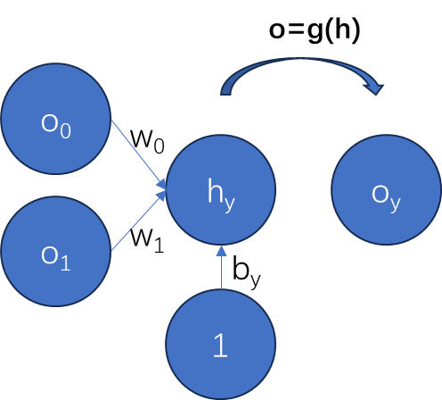
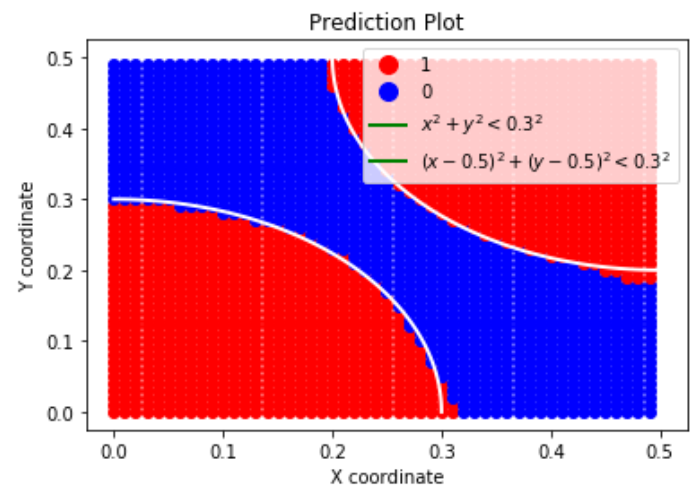
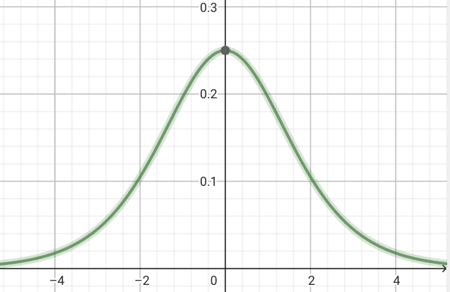

# Neuron_MLP


无法正常查看数学公式？点击[这里](null.html)（还没转html（））

笨人无才，仓库名字打错了w。

基于C++实现的神经网络。

如需在python中使用，请保证支持C++11及以上标准。

## 宏

使用`ETHY_NEURON`作为宏保护。

```
// to make it easier for programming.
typedef std::vector<double> my_vector;
typedef std::vector<my_vector> single_power;
typedef std::vector<single_power> my_power;
```

为了使逻辑简单，读我文档的函数列表中，仍使用std标准名。

## Public Members

在`MyNeuron`类中，有以下公有成员：

* 变量

`int LR_VOKE`: 每经过LR_VOKE次迭代，系统会输出当前的权重w，偏置b以损失。

* 方法

`MyNeuron(); 空构造器。默认调用`MyNeuron(100,0.01)`

`MyNeuron(int epoches, double lr);` 默认构造输入大小为2，隐藏层为1层（含3个神经元）的神经网络。即默认调用`MyNeuron(epoches, lr, 2, {3})`

`MyNeuron(int epoches, double lr,int inputSize, std::vector<double>&hiddenLayers);`

**参数**：

* *epoches*: 学习的迭代次数。

* *lr*: 学习率。

* *inputSIze*: 输入大小，即输入层的神经元数量。

* *hiddenLayers*: 隐藏层。hiddenLayers[i]的值为隐藏层第(i+1))层的神经元数量。例如对于下图：

  

  <p align='center'><font size=3>图2-1</font></p>

  有两层隐藏层。第一层有4个神经元，即hiddenLayers[0]=4；同理，hiddenLayers[1]=4。

  同样以上图为例。假设迭代次数为10000， 学习率为0.01，其参数传递为：

  ```c++
  MyNeuron neuron(10000, 0.01, 3, {4,4});
  ```

`MyNeuron(int epoches, double lr, int inputSize, double*hiddenLayers, int hiddenSize);`：todo。

`double sigmoid(double x);` 激活函数。使用sigmoid函数$g(x)=\frac1{1+e^x}$作为激活函数。

`double d_sigmoid(double x);` 激活函数的导函数。

`my_vector& forward(my_vector& data);` 前向计算。根据**已有的$\omega,~b$**计算神经网络中各层的输出结果。返回最终的输出。

返回：

* 目前输出层默认（也只能emmm，笨人无才，不会多层）为1*1的一维矩阵。如图2-1，则这个函数的输出结果是output layer。详情查看：==todo==

<font size=4>`void train(std::vector<my_vector>& data, my_vector& label);`</font> 训练神经网络。

参数：

* `std::vector<std::vector<double>>& data`: 训练数据的输入，是一个二维的double数组。使用引用传递提升效率。

* `my_vector& label`: 训练数据的标记。通常为1.0或者0.0，也可以是1.0或者0.0乘上一个权重。

  **请保证data.size()与label.size()**相等，并保证每一行输入的维度等于输入层神经元数量（即data[i].size()与inputSize相等）。

`double predict(my_vector& input, double threshold);` 预测。

参数：

* *input*: 一个1*inputSize的double类型数组。

* *threshold*：阈值。超过这个阈值，predict值将会返回1.0，否则返回0.0。

  参见==todo==。

返回：

* `double` 返回预测值。默认为1.0或0.0，在函数中更改判断条件也可直接返回经过激活函数的输出值。

`void setLR_VOKE(int LR_VOKE);`公有成员变量`LR_VOKE`的设置者。


## Realization of Certain Methods

### Realization of forward calculating

假设从第i层（假设大小为m）神经元组传递到第i+1层（假设大小为n）神经元组。假设从第i层第j个神经元传递到第i+1层的第k个神经元。

从第i层第j个神经元传递到第i+1层的第k个神经元的权重在这里将被定义为$\omega_{jk}$。

第i+1层第k个神经元的计算结果，将会等于上一层每一个神经元，乘以每一个神经元传递到这个神经元的权重。显然，第i+1层第k个神经元可以被计算为：
$$
神经元（i+1,k)=\sum_{j=0}^m
\omega_{jk}\cdot 神经元(i,j)+bias(i+1,k)
$$
<p align='center'><font size=3>式3-1</font></p>

可以知道，第i+1层神经元的第k个神经元，需要m个权重进行计算。那么对于第i+1层神经元（一共n个），需要n次m个权重进行计算。因此，第i层到第i+1层的权重维度为$m\times n$。

假设包含了输入和输出的layer共有l层，从左往右两两之间有一组权重。因此可以声明的权重数组将会是一个长度为**l-1**的**三维数组**。每一层权重（二维数组）的维度为该组**对应的**$输入层神经元数量\times 输出神经元数量$。

据此，声明以下几个私有变量：

```c++
std::vector<my_vector> h;	//layer output storage; dimension is 2; includes input layer and output layer.
std::vector<my_vector> o;	//after sigmoid output layer.
std::vector<my_vector> b;	//bias, dimension is 2 to fix each layer h.
my_power w;					//power, dimension is three
```

这几个变量将具有如下几个关系：==todo 插入描述图==

其中，h和o包括了input和output的layer。

将式3-1改写为如下形式：
$$
h(i+1,k)=\sum_{j=0}^m
\omega_{jk}\cdot o(i,j)+b(i+1,k)
$$
因此：

```c++
my_vector& forward(my_vector& data){
    // 用输入数据初始化第一层的输出
    h[0].assign(data.begin(), data.end());
    o[0].assign(data.begin(), data.end());//输入层，不需要sigmoid
    // 进行前向传播。
    int h_max = this->h.size();
    //每两层之间一个操作，循环次数为h的大小减去1
    for (int i = 0; i < h_max-1; ++i) {
        //提高可读性，用layerIndex代替i
        int& layerIndex = i;
        //
        for(int j = 0; j < h[layerIndex+1],size();++j){
            //提高可读性，用nextNeuronIndex
            int& nextNeuronIndex = j;
            //计算
            for(int k = 0; k < h[layerIndex].size(); ++k){
                //提高可读性，用neuronIndex
                int& lastNeuronIndex = k;
                h[layerIndex+1][nextNeuronIndex] += o[layerIndex][lastNeuronIndex]*w[layerIndex][lastNeuronIndex][nextNeuronIndex];
            }
            //加上偏置
            h[layerIndex+1][nextNeuronIndex] += b[layerIndex+1][nextNeuronIndex];
            //应用激活函数
            o[layerIndex+1][nextNeuronIndex] = sigmoid( h[layerIndex+1][nextNeuronIndex]);
        }
    }
    // 返回最后一层的输出
    return this->o[this->o.size() - 1];
}
```

### Realization of Training-backward

反向计算主要依据这个公式进行计算。


$$
\delta \omega_{ki}=\frac{d E}{d \pmb{ \omega_{k}}}\cdot lr
\\
\frac{\part E}{\part \omega_{ki}}=
\frac{\part E}{\part o_k}
\frac{\part o_k}{\part z_k}
\frac{\part z_k}{\part w_{ki}}
$$
<p align='center'><font size=3>式3-2</font></p>

其中，E表示输出神经元的标签与预测值的损失函数。本文将以这个三层的神经网络为例（其中偏置未被画出，将在之后单独给出偏置的推导）。



* 从输出层开始的反向计算

  $E=\frac 12(y_{pred}-y_{label})^2$。在这一层，$y_{pred}$就是$o_k$。得到：
  $$
  \frac{\part E}{\part o_k}=
  y_{pred}-y_{label}
  $$
  <p align='center'><font size=3>式3-3</font></p>
  
  由于使用激活函数g(z)，于是$o_k=g(z_k)$, 那么：
  $$
  \frac{\part o_k}{\part z_k}=g'(z_k)\\
  %\rightarrow
  %\frac{\part o}{\part h}=g'(h)\\
  $$
  这里的$z_k$即为先前的$h$的第k个元素(注意g'()内的参数是z~k~不是o~k~)。
  
  根据式3-1
  
  > $$
  > h(i+1,k)=\sum_{j=0}^m
  > \omega_{jk}\cdot o(i,j)+b(i+1,k)
  > $$
  
  得到：
  $$
  \frac{\part z_k}{\part w_{ki}}=
  \frac{\part h(i+1,k)}{\part w_{ijk}}\\=
  o(i,j)
  $$
  于是对于输出层：
  
  
  $$
  \frac{\part E}{\part \omega_{ki}}=
  (y_{pred}-y_{label})\cdot
  g'(z_k)\cdot
  o(i,j)
  $$
  
  
  
  例如对于这个输出层的模型，如果我们要计算损失值对$\omega_0$的偏导数：
  
  
  $$
  \frac{\part E}{\part \omega_{0}}=
  (o_y-y_{label})\cdot
  g'(h_y)\cdot
  o_0\\
  $$
  图中，$o_0~o_1$表示上一层输出（经过激活函数的h），其中，图中的$o_y$即为$y_{pred}$。
  
  那么，bias怎么办呢？回顾前向计算公式，仍然以这个例子为例：
  $$
  o_y=g(o_0\omega_0+o_1\omega_1+b_y)\\
  $$
  误差函数对$\omega$的雅可比可以表示为：
  $$
  \frac{d E}{d \pmb \omega}=
  \frac{\part E}{\part \omega_{0}}+\frac{\part E}{\part \omega_{1}}
  $$
  
  <p align='center'><font size=3>式3-4</font></p>
  
  对于bias：可以把bias看作是一个从上一层恒定输出为1，权重为$b_y$的一个传递：
  
  显然，它可以被等效为：
  
  
  $$
  \frac{\part E}{\part b_y}=
  (o_y-y_{label})\cdot
  g'(h_y)\cdot
  1\\
  \rightarrow 
  \delta b_y = %\frac{d E}{d ( \pmb{\omega\cdot o})} \cdot lr\\=
  (o_y-y_{label})\cdot
  g'(h_y)\cdot
  lr\\
  $$
  
  最后，得到一组更新公式：
  
  $$
  \delta \omega_i=
  (o_y-y_{label})\cdot
  g'(h_y)\cdot
  o_i\cdot lr\\
  \delta b_y = %\frac{d E}{d ( \pmb{\omega\cdot o})} \cdot lr\\=
  (o_y-y_{label})\cdot
  g'(h_y)\cdot
  lr
  $$
  
  <p align = 'center'><font size = 3>
      式3-5
      </font>
  </p>
  
  注意到，两组数据都有$(o_y-y_{label})\cdot
  g'(h_y)$。为了简化运算，笔者将使用`std::vector<std::Vector>> layerGradients`(注意变量名，有's')对其进行保存以降低时间复杂度。在C++中表示为
  
  ```C++
  void backward(my_vector&data, double y_label){
      my_vector&output_o = forward(data);
      my_vector&output_h = h[h.size()-1];
      double y_pred = output_o[0];
      
      double error = y_pred - y_label;//注意：这里与MyNeuron.cpp的实现不同。原工程文件中定义error=y_label - y_pred，因此后面更新梯度时，原文件里第434行，第443行使用的是加号而非减号。
      //计算E对w的偏导数的梯度，即(o_y-y_label)*g'(h)。输出层，只有一个。
      my_vector outputLayerGradient(1, error*d_sigmoid(output_h[0]));
      //...
  }
  ```
  
  *注意*： `std::vector<T>(int size, T elm)`这个构造器表示，构建一个长度为size，每个元素为elm的数组。
  
* 隐藏层和输入层

  在输出层表明了label之后，我们可以根据后面的数据，逐层往前传递。隐藏层的推导和输出层的推导方法基本一致。只是需要注意error的计算。==todo==

  

  预留

  预留

  ```c++
  void backward(my_vector&data, double y_label){
      //...
      std::my_vector<my_vector> layerGradients;
  	layerGradients.push_back(outputLayer);//将输出层梯度
      //从后往前传
      for(int layerIndex = h.size()-2; layerIndex>=0; --layerIndex){
          my_vector layerGradient;
          //计算该层神经元
          for(int neuronIndex = 0; neuronIndex<h[layerIndex].size; ++neuronIndex){
              double gradientSum = 0.0;
              for(int nextNeuronIndex = 0; nextNeuronIndex<h[layerIndex+1]; ++nextNeuronIndex){
                  gradientSum += w[layerIndex][neuronIndex][nextNeuronIndex] * layerGradients[0][nextNeuronIndex];//todo: check正向加入的layerGradients是否正确！
              }
              layerGradient.push_back(gradientSum*d_sigmoid(h[layerIndex][neuronIndex]));
          }
          layerGradients.insert(0, layerGradient);//插入到首位
      }
      //...
  }
  ```

  *注意*：`std::vector<T>.push_back(T)`表示在vector尾部插入元素，`std::vector<T>.insert(0, T)`表示在vector头部插入元素。T为要插入的元素。

* 更新权重与偏置：乘以学习率和上一层的输出。

  预留

  ```c++
  void backward(my_vector&data, double y_label){
          //...
          std::my_vector<my_vector> layerGradients;
      layerGradients.push_back(outputLayer);
          //从后往前传
          for(int layerIndex = h.size()-2; layerIndex>=0; --layerIndex){
              my_vector layerGradient;
              //计算该层神经元
              for(int neuronIndex = 0; neuronIndex<h[layerIndex].size; ++neuronIndex){
                  double gradientSum = 0.0;
                  for(int nextNeuronIndex = 0; nextNeuronIndex<h[layerIndex+1]; ++nextNeuronIndex){
                      gradientSum += w[layerIndex][neuronIndex][nextNeuronIndex] * layerGradients[0][nextNeuronIndex];//todo: check正向加入的layerGradients是否正确！
                  }
                  layerGradient.push_back(gradientSum*d_sigmoid(h[layerIndex][neuronIndex]));
              }
              layerGradients.insert(0, layerGradient);//插入到首位
          }
          //...
          for (int layerIndex = 0; layerIndex < w.size(); ++layerIndex) {
              for (int neuronIndex = 0; neuronIndex < w[layerIndex].size(); ++neuronIndex) {
                  for (int nextNeuronIndex = 0; nextNeuronIndex < w[layerIndex][neuronIndex].size(); ++nextNeuronIndex) {
                      w[layerIndex][neuronIndex][nextNeuronIndex] -= learning * o[layerIndex][neuronIndex] * layerGradients[layerIndex][nextNeuronIndex];//check: 更新到顺序运算后，检查训练结果有没有问题。
                  }
              }
              for (int biasIndex = 0; biasIndex < b[layerIndex].size(); ++biasIndex) {
                  b[layerIndex][biasIndex] -= learning * layerGradients[layerIndex][biasIndex];//check: 更新到顺序运算后，检查训练结果有没有问题。
          }
      }
  }
  ```
  
  优化：使用`std::vector<T>.push_back(T)`或`std::Vector<T>.insert(T)`操作可能会多次进行操作空间开辟和拷贝（层数少的时候这个空间开辟数量会减少，时间消耗可以接近于传统赋值操作），影响效率，可以考虑提前声明合适长度的数组，然后对每个元素进行赋值操作。
  
* 训练

  预留

  ```c++
  void MyNeuron::train(std::vector<my_vector>& data, my_vector& label) {
      assert(data.size() == label.size());  // 确保数据和标签的数量匹配
      assert(data[0].size == h[0].size());
      //假定输出维度为1*1.多维输出能力不够，不会。
      for (int epoch = 0; epoch < epoches; ++epoch) {
          for (int dataIndex = 0; dataIndex < data.size(); ++dataIndex) {
              backward(data[i], label[i]);
          }
      }
  }
  ```
  

至此，该神经网络能够被实现。

## Train Set for Examing

测试信息被包含在了`Main.cpp`的主函数内。基本方法是，生成一组训练集，然后对该网络进行训练；生成测试集，对测试集的预测结果和标签进行比较，计算准确率。

例如，选定数据集和测试集为平面(0,0)到(0.5,0.5)之间的点集合，假定满足：
$$
pred(x,y)=x^2+y^2<0.09~or~(x-0.5)^2+(y-0.5)^2<0.09)?1:0
$$
即：在平面(0,0)\~(1,1)范围内，处在$x^2+y^2<0.3^2$或者$(x-0.5)^2+(y-0.5)^2<0.3^2$（即以(0,0)和（0.5,0.5）为圆心，半径为0.3的圆）内的点，设置label为1，否则为0，选取适当参数对模型进行训练。

训练结果如下：



其中，红色部分表示预测值为1的坐标，蓝色值表示预测值为0的坐标。白线范围表示两个圆在(0,0)到(0.5,0.5)的边界。


## Use in Python

PY_MPL是经过封装的用于提供python接口的header file。如需使用，请保证您的python环境下安装了cppyy库：

```bash
pip install cppyy
```

也可以尝试使用`pybind11`等库。本文将介绍通过cppyy完成python与c++动态链接库之间的交联。

* 检测是否成功安装

  在python程序源代码中输入

  ```python
  import cppyy
  import ctypes
  ```

  如果没有报错，那么可以进行下一步了。

确保准备工作齐全后，使用CMake指令（==todo==: 编写CMakeList.txt），将该库编译为动态链接文件

```bash
mkdir build
cd build
cmake ..
cmake --build . --config Release
```

在同目录的Release文件夹下的build目录内，找到bin或者lib目录（或者其他），在其中可以找到对应的`.dll`动态链接库

# Problems to be solven

## Disappearance and Dxplosion in Gradient Calculating

解决梯度消失：<!-->todo: 叙述梯度消失与爆炸的解决方案<-->

根据梯度更新公式（式3-5）：
$$
\delta \omega_i=
(o_y-y_{label})\cdot
g'(h_y)\cdot
o_i\cdot lr\\
\delta b_y = %\frac{d E}{d ( \pmb{\omega\cdot o})} \cdot lr\\=
(o_y-y_{label})\cdot
g'(h_y)\cdot
lr
$$
使用sigmoid函数作为激活函数，显然我们发现：
$$
\frac{d}{dx}sigmoid(x)=\frac{
	e^{-x}
}{
	(1+e^{-x})^2
}
\\
\frac{d^2}{dx^2}sigmoid(x)=
\frac{
	-e^{-x}(1-e^{-x})
}{
	(1+e^{-x})^3
}
$$
对其二阶导进行分析，可知：

|              | x<0              | x=0              | x>0              |
| ------------ | ---------------- | ---------------- | ---------------- |
| sigmoid'(x)  | 单调增           | 最大值=0.25      | 单调减           |
| sigmoid''(x) | $sigmoid''(x)>0$ | $sigmoid''(x)=0$ | $sigmoid''(x)<0$ |



<p align = 'center'>图4-1 sigmoid的导函数图<font size=3></font></p>

也就是说，每一次梯度更新，从后往前，每递推一层，error变化差异的显著性不会超过上一层的$\frac14$

```c++
class ReLuMLP:public MyNeuron {。
    double sigmoid(double x) override {
        return x > 0.0 ? x : 0.0;
    }

    double d_sigmoid(double x) override {
        return x > 0.0 ? 1.0 : 0.0;
    }
public:
    ReLuMLP(int ep, double lr, int is, std::vector<int>& layers) :MyNeuron(ep, lr, is, layers) {}
};
```

测试：

使用600个数据进行训练，迭代4000次，对7层神经网络（二维输入，一维输出，隐藏层神经元数量分别为3，5，16，2，4，7）进行测试。使用500个数据进行测试。

得：

```bash
correct rate using sigmoid: 63.2% with loss 0.230864
correct rate using reLU:	97.8% with loss 0.007517
```

# Dependences

* c++万能头文件<bits/stdc++.h>: 如果没有这个头文件，请将工程文件中的

  ```c++
  #include <bits/stdc++.h>
  ```

  替换为：

  ```c++
  #include <vector>
  #include <iostream>
  #include <cassert>
  #include <stdexcept> 
  #include <random>
  #include <cstdlib> 
  #include <ctime>
  ```

  在python中，完成：

  ```python
  import cppyy
  import ctypes
  cppyy.include("path/to/your/PY_MPL.dll")
  ```

  新建实例：

  ```python
  mpl = cppyy.gbl.PY_MPL() # 仅提供默认构造函数。使用initMPL函数对其进行初始化。
  hlv = cppyy.gbl.std.vector[int]([2,3,3]) # 新建std::vector<int>类型的实例变量。注意，vector的传递需要进行打包。
  
  # 仅提供一个初始化函数。参数列表为：
  # int epoches
  # double lr
  # int inputSize
  # std::Vector<int> hiddenLayerSizes
  mlp.initMPL(20000,0.085,2,hlv) 
  ```
  
  
